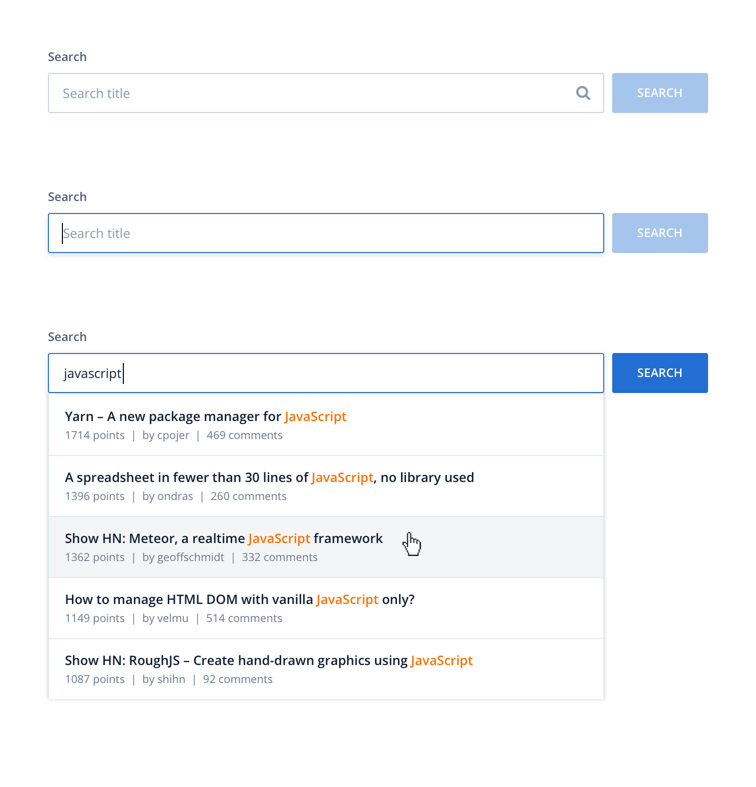

# Auto-suggester

## Instructions

Create an auto-suggest input field where the user would type at least 3 letters of a Hacker News story title and display the available stories in a dropdown list, similar to the following image:

### Requirements

- Implement your solution using JavaScript (or TypeScript) and React;
- Your target browser is the latest Chrome or Firefox - no need to cater for outdated browsers;
- Use the Hacker News Search API to retrieve stories in real-time (https://hn.algolia.com/api). No authentication required;
- You may use Create React App (CRA) or any similar scaffolding tool;
- You may use any functional libraries of your choice, e.g. lodash, rxjs, redux, react-query, etc;
- You must NOT use any UI component library or CSS framework (e.g. material-ui, bootstrap, tailwind, etc) as it beats the purpose of this exercise;
- Include simple instructions on how to run your code on a browser. A short list of commands would suffice.

### Notes

- The button is decorative. The dropdown should trigger on typing 3+ chars, not on clicking the button;
- The search should retrieve exact matches on story titles. No fuzzy search;
- Limit suggested results to 5;
- Tests are optional, but highly valued.

### Skills assessment

- Familiarity with JavaScript and React;
- HTML/CSS skills;
- Attention to detail;
- Ability to find the right tools for the job;
- Logic and code structure.

### Time requirement

2-4 hours

## Solution:

### After cloning the project

- Run `npm i`

### To run this project

- Run `npm run start`

### To build this project

- Run `npm run build`

### To run tests for this project

- Run `npm test`

### Live demo

- Nothing is yet written in this section.

### Improvements in mind

- Nothing is yet written in this section.

### Bugs found

- Nothing is yet written in this section.

## How I worked on this project step by step

For this project, some knowledge of html, css, js & react is needed. If you don't know about npm, git, webpack, eslint & prettier you should at least check what they are and how they work before continuing.
I didn't use `npx create-react-app ...` to demostrate my ability to choose my tools and I like to use only whatever I need.

### Step 1, Creating a basic app

Commands I used for this step:

- `npm i`
- `npm i -D webpack webpack-cli webpack-dev-server webpack-dev-server html-webpack-plugin babel-loader @babel/core @babel/preset-env @babel/preset-env @babel/preset-react style-loader css-loader`

[package.json](package.json) was created by the `npm i` command.
[package-lock.json](package-lock.json) was generated automatically and shouldn't be touched. For more info about it, read [this](https://docs.npmjs.com/cli/v8/configuring-npm/package-lock-json).

Webpack

- basic dependencies needed for server to work:
  - [webpack](https://webpack.js.org/concepts/)
  - webpack-cli
  - [webpack-dev-server](https://webpack.js.org/api/webpack-dev-server/#root)
- plugin needed for html files:
  - [html-webpack-plugin](https://webpack.js.org/plugins/html-webpack-plugin/#root)
- loader dependencies needed for js & rxjs:
  - [babel-loader](https://webpack.js.org/loaders/babel-loader/#root)
  - [@babel/core](https://babeljs.io/docs/en/babel-core)
  - [@babel/preset-env](https://babeljs.io/docs/en/babel-preset-env) (added to options-presets)
  - [@babel/preset-react](https://babeljs.io/docs/en/babel-preset-react) (added to options-presets)
- loaders needed for css:
  - [style-loader](https://webpack.js.org/loaders/style-loader/#root)
  - [css-loader](https://webpack.js.org/loaders/css-loader/#root)
- entry point:
  - I did set the [entry](https://webpack.js.org/concepts/#entry) point in the [webpack configuration file](webpack.config.js)
- mode:
  - I did set [mode](https://webpack.js.org/concepts/#mode) to "development" temporary in the [webpack configuration file](webpack.config.js)

Prepared the react app in "src" folder:

- [index.html](./src/index.html), has the html head & a body with an element, which should have id "app" to be able to be targeted later
- [index.js](./src/index.js), creates the app component and put it into the element with id "app" (don't forget to import the css to test it)
- [app.js](./src/app.js), contains the main app
- [index.css](./src/index.css), contains the css which is going to apply to the whole app

The project at the of this step has the essentials to run with the command `webpack serve --open`.

### Step 2, Keeping some good practices

Commands I used for this step:

- `git init`
- `npm i -D eslint eslint-plugin-jsx-a11y eslint-plugin-import eslint-plugin-hooks eslint-webpack-plugin path browserlist`
- `./node_modules/.bin/eslint --init`

Git installation:

- git initiliazed
- [.gitignore](.gitignore) file created (always ignore at least node_modules/ & dist/ )
- committing in regular basis
- using descriptive messages & tags to keep things clear

Specified the version of npm to keep consistency:

- [.nvmrc](.nvmrc) file created
- I set engines in [package.json](package.json)

installing eslint and its plugins to reduce errors while coding:

- [eslint](https://www.npmjs.com/package/eslint) _I have run`./node_modules/.bin/eslint --init` to create [eslint config file](.eslintrc.json)_
- [eslint-plugin-react](https://www.npmjs.com/package/eslint-plugin-react) _this one should be installed from the last command_
- [eslint-plugin-jsx-a11y](https://www.npmjs.com/package/eslint-plugin-jsx-a11y) _to help with accessibilities issues such as a missing property alt from an img element_
- [eslint-plugin-import](https://www.npmjs.com/package/eslint-plugin-import) _to track misspelt imports and other errors about importing_
- [eslint-plugin-hooks](https://www.npmjs.com/package/eslint-plugin-react-hooks) _helps to deal with hooks_
- also, node env was set to true as well, otherwise [webpack.config file](webpack.config.js) would have errors
- last but not least detected react version

further changes in [webpack.config file](webpack.config.js):

- have added a plugin to resolve some javascript eslint issues `eslint-webpack-plugin`
- for paths to have better scalability imported and used `paths` package
- have set [ouput](https://webpack.js.org/concepts/#output) & [devServer](https://webpack.js.org/configuration/dev-server/#root) to not let it to the default ones
- have set [devtool](https://webpack.js.org/configuration/devtool/#root) to inline-source-map to help with debugging javascript in browser for development mode
- have set [mode](https://webpack.js.org/concepts/#mode) based on an environment variable to be able to easily switch between modes (default is good to be "development")

prettier:

- There are several ways to deal with prettier. [.prettierrc.json](.prettierrc.json) should contain an empty object or the extra rules for formatting we want to change for the specific project. I have configured my VScode to format on save when this file exists. The extension I use is [Prettier - Code formatter](https://marketplace.visualstudio.com/items?itemName=esbenp.prettier-vscode)

In [package.json](package.json) is good to have:

- [description](https://docs.npmjs.com/cli/v8/configuring-npm/package-json#version) a description is always good to have
- [scripts](https://docs.npmjs.com/cli/v8/configuring-npm/package-json#scripts) for webpack development & production mode. Later on, a script for tests should be added but for now we left it as is
- [author](https://docs.npmjs.com/cli/v8/configuring-npm/package-json#people-fields-author-contributors) always good to mention the author or the contributors
- [email](https://docs.npmjs.com/cli/v8/configuring-npm/package-json#bugs) an e-mail for people to be able to report to you issues
- [repository](https://docs.npmjs.com/cli/v8/configuring-npm/package-json#repository) to easily access the online repo
- [browserslist](https://github.com/browserslist/browserslist) to show which browsers versions are supported. (this one is an npm package)

Created a README file with markup, which at least contains:

- the title of the project
- small description of what it does
- how to run the project
- how to build it
- how to run tests
- improvements in mind
- list of any bugs found
- link with a live demo
- links with sources

### Step 3, creating initial structure

For accessibility reasons we will use a heading, which is going to be hidden. Two dummy elements, one before and one after the suggester, will be used for demo purposes.

For this suggester component we can use one of those 2 element structures:

Structure 1 (the one I choose):

- form
  - label
  - input
  - button

Structure 2:

- form
  - label
    - input
  - button

The label element in the 1st structure needs the `for` attribute for accessibility reasons while the input element will need an `id` to be able to be associated with the label. With this approach we won't need an extra span element to be able to target the text in the label later on, as well as I prefer this kind of structure since it seems clearer for me.

The input is expected to be type of text and it is good to have a name as well.

All the elements will need a class so that we will be able to target them with css later on.

A good idea here is to add div elements to create rows since we want input & button in the same row.
